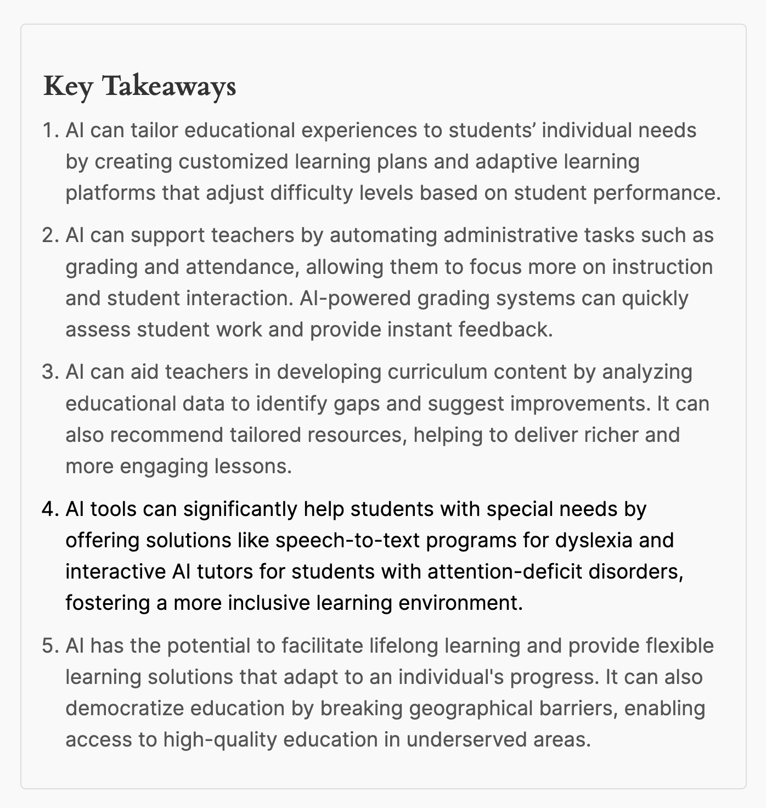
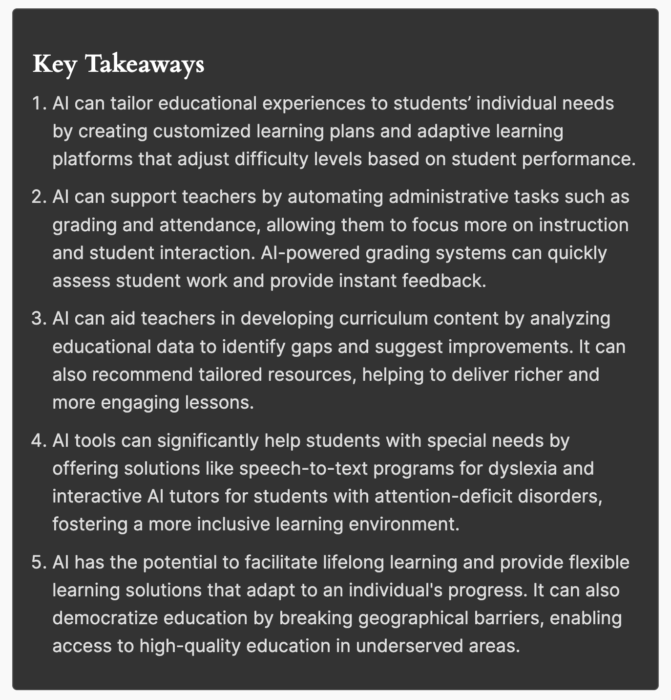
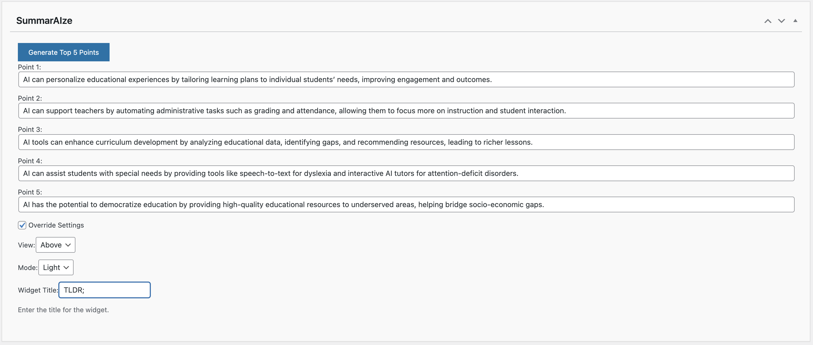
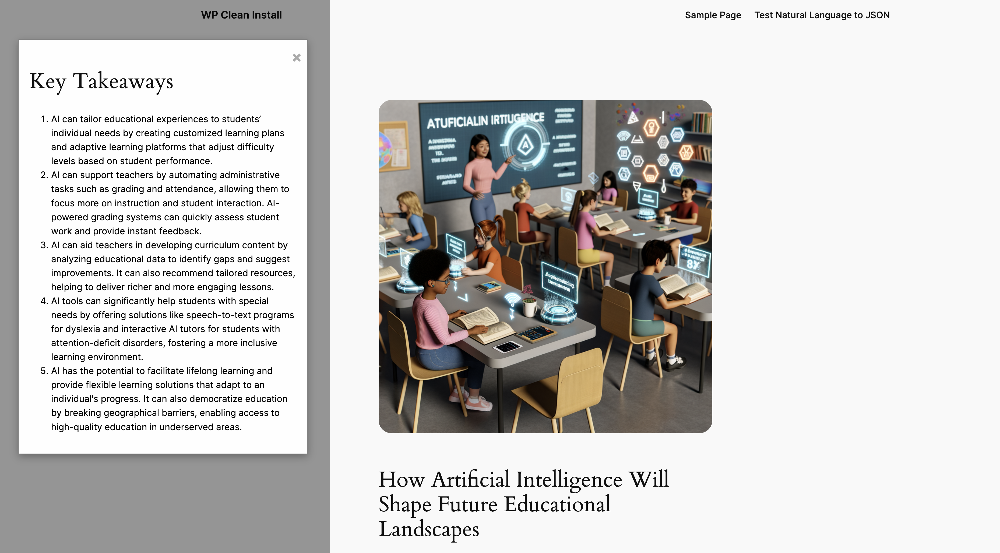
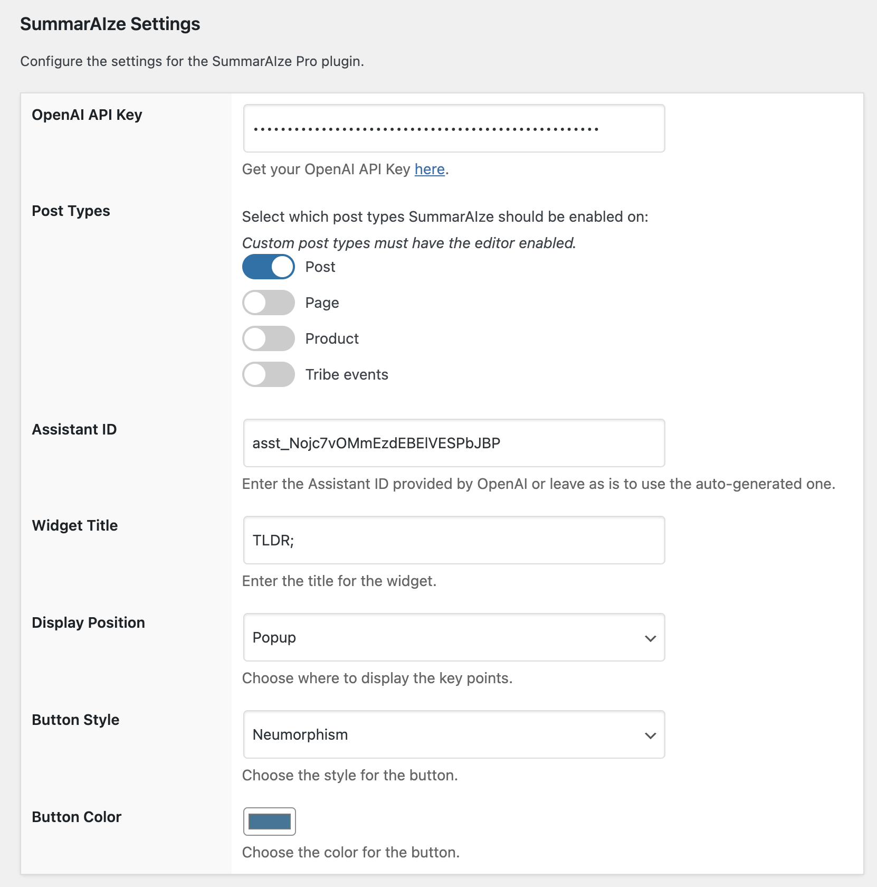
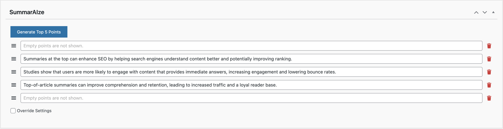

# SummarAIze - Unlock the Power of AI Summaries for WordPress

## Description

**Stop Losing Readers! Instantly Grab Attention with AI-Powered Summaries.** SummarAIze uses OpenAI or Google Gemini to boost engagement and SEO!

**Tired of visitors bouncing from your WordPress site? Wish there was a way to instantly show them the value of your content?**

SummarAIze is the *secret weapon* you need. This powerful, yet incredibly easy-to-use, plugin leverages the cutting-edge AI of **both OpenAI and Google Gemini** to automatically generate concise, engaging summaries (key takeaways) for your posts and pages.

**Here's how SummarAIze will transform your WordPress site:**

*   **Boost Reader Engagement:** Hook readers instantly with clear, concise summaries that highlight the most important points of your content.
*   **Improve Readability:** Make even complex articles easy to digest, leading to increased time on site and lower bounce rates.
*   **Enhance SEO:** Provide search engines with structured, keyword-rich summaries, improving your search visibility.
*   **Save Time & Effort:** Stop manually writing summaries! SummarAIze automates the process, freeing you up to focus on creating great content.
*   **Choose Your AI Powerhouse:** Select between the industry-leading **OpenAI** or the innovative **Google Gemini** – you're in control!
*   **Supercharge Your Content, Effortlessly.** Installation takes minutes, and the results are immediate.

### Important Information

SummarAIze uses either the **OpenAI API** or the **Google Gemini API** for summary generation. This requires sending your post content to the selected provider's servers. By using this plugin, you agree to their respective terms and policies:

*   **OpenAI:** [Terms of Use](https://openai.com/terms) and [Privacy Policy](https://openai.com/privacy)
*   **Google Gemini:** [Privacy Policy](https://policies.google.com/privacy) and [Terms of Service](https://policies.google.com/terms)

## Features

*   **Dual AI Engines:** Unleash the power of *either* OpenAI *or* Google Gemini – the choice is yours! Easily switch between providers in the settings.
*   **Automatic Summary Generation:** No more manual work! SummarAIze intelligently extracts the top 5 key takeaways from your content.
*   **Flexible Display Options:** Show summaries *above* your content, *below* it, or even in a slick *popup* – perfect for any theme.
*   **Drag-and-Drop Simplicity:** Reorder key takeaways with ease using the intuitive drag-and-drop interface.
*   **Customizable Appearance:** Use shortcodes to control list style (ordered/unordered), light/dark mode, and even popup button styling.
*   **SEO Friendly:** Structured summaries help search engines understand your content better.
*   **Privacy Conscious:** Only the necessary content is sent to the selected AI provider (OpenAI or Google Gemini) for processing.

## Drag-and-Drop Feature

You can easily reorder your key takeaways using the drag-and-drop functionality:

1.  Hover over the point you want to reorder.
2.  Click and hold the "menu" icon (represented by the three lines) to the left of the point.
3.  Drag the point to your desired position in the list.
4.  The new order is automatically updated and saved when you publish or update the post.

Empty points will be removed from the front-end display automatically.

## Shortcode Documentation

### Basic Shortcode Usage:

`[summaraize]`

### Available Attributes:

*   **`id`** *(optional)*: The post ID for which to display the key points. Default: current post ID.  Example: `[summaraize id="123"]`
*   **`view`** *(optional)*: Defines where the output should be positioned. Possible values: `popup`, `above`, `below`. Default: `above`. Example: `[summaraize view="popup"]`
*   **`mode`** *(optional)*: Sets the display mode (light or dark). Possible values: `light`, `dark`. Default: `light`. Example: `[summaraize mode="dark"]`
*   **`title`** *(optional)*: Sets a custom title. Default: "Key Takeaways". Example: `[summaraize title="Quick Summary"]`
*   **`button_style`** *(optional)*: Defines the popup button style (if `view="popup"`). Default: `flat`. Example: `[summaraize view="popup" button_style="rounded"]`
*   **`button_color`** *(optional)*: Sets the popup button background color (if `view="popup"`). Default: `#0073aa`. Example: `[summaraize view="popup" button_color="#ff0000"]`
*   **`list_type`** *(optional)*: Specifies the list display (ordered or unordered). Possible values: `ordered`, `unordered`. Default: `unordered`. Example: `[summaraize list_type="ordered"]`

### Example Usage:

*   Basic Usage: `[summaraize]`
*   Popup Style: `[summaraize view="popup" button_style="rounded" button_color="#ff0000"]`
*   Dark Mode with Custom Title: `[summaraize mode="dark" title="Quick Summary"]`
*   Ordered List Below Content: `[summaraize view="below" list_type="ordered"]`

## Installation

1.  Upload the `summaraize` folder to the `/wp-content/plugins/` directory, or install the plugin directly via the WordPress plugins screen (search for "SummarAIze").
2.  Activate the plugin through the 'Plugins' menu in WordPress.
3.  Go to Settings > SummarAIze. Select your preferred AI provider (OpenAI or Google Gemini) and enter your API key.

## Privacy

SummarAIze only sends the content of your posts to the selected AI provider (OpenAI or Google Gemini) for processing. No personal or sensitive data is transmitted.

## Frequently Asked Questions

### Do I need an API key?

Yes, you'll need an API key for *either* OpenAI *or* Google Gemini. Both services offer free tiers (subject to their terms), but higher usage may require a paid account.

### Can I customize the summaries?

Absolutely! You can edit the generated key takeaways directly in the post editor, and you can use shortcodes to control how they are displayed.

### How much does SummarAIze cost?

The SummarAIze plugin itself is **free and open-source**. However, using the OpenAI or Google Gemini APIs may incur costs, depending on your usage and their pricing plans.

### How do I switch between OpenAI and Google Gemini?

It's easy! Just go to Settings > SummarAIze, choose your preferred provider, and enter the corresponding API key.

### Is my data safe?

SummarAIze only sends the content of your posts to the selected AI provider for processing. No personal or sensitive data is shared.

## Screenshots

1.   *Configure whether the key points appear above or below the content.*
2.   *Display key points in dark mode for a better visual experience.*
3.   *Interface for generating and editing key points in the Classic Editor.*
4.   *Display key points in a popup view.*
5.   *The settings page for configuring display options.*
6.   *Reorder key points easily with drag-and-drop functionality.*

## Changelog

### 1.2.0

*   **Major Feature:** Added full support for the Google Gemini API, including configuration options in the settings page.
*   Updated documentation to reflect Gemini integration.
*   Improved error handling for API requests.
*   General code cleanup and optimization.

### 1.1.16

*   Fixed metabox data saving issue.
*   Improved UI for metabox inputs.
*   Minor bug fixes and optimizations.

### 1.1.11

*   Added drag-and-drop functionality to reorder points.
*   Automatically removes empty points from the display.

### 1.1.10

*   Added shortcode customization options for layout and style.

### 1.1.0

*   Enabled dynamic Assistant creation via API.

### 1.0.0

*   Initial release.

## License

This plugin is licensed under the GPLv2 or later.

## Donate

If you find this plugin useful, please consider [donating](https://oneclickcontent.com/donate/) to support further development.

**Ready to transform your WordPress content and boost engagement? Install SummarAIze today!**