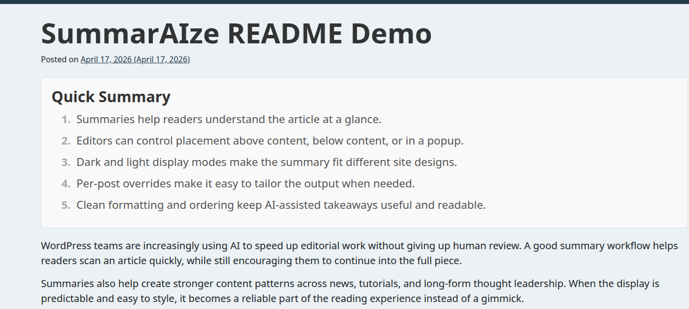
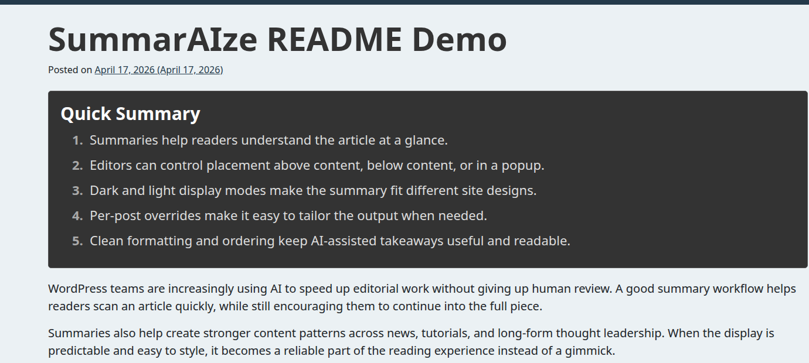
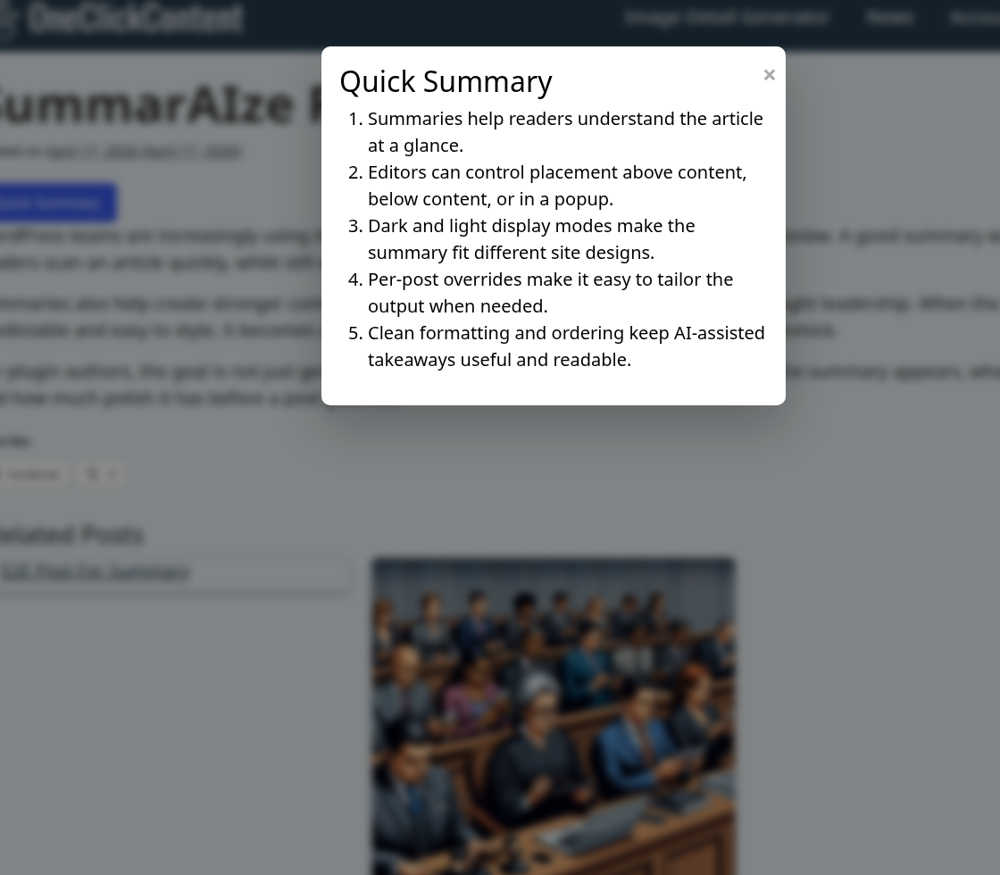
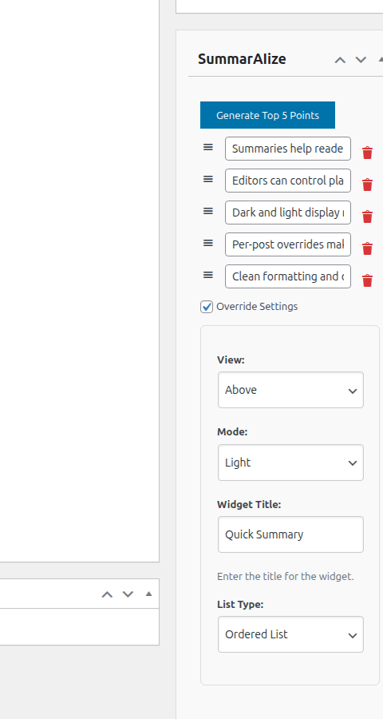

# SummarAIze

Publisher-controlled AI key takeaways for WordPress. SummarAIze helps publishers generate, edit, bulk-manage, and display editor-approved summaries using their own OpenAI or Google Gemini API key.

## Why SummarAIze

- Built for publishers who want editor-approved key takeaways, not a black-box hosted summary feed
- Free plugin with no bundled credits, SummarAIze-hosted relay, or monthly summary quota
- Use your own OpenAI or Google Gemini account, including GPT-5.5, and control your model spend
- Generate, edit, and reorder takeaways directly inside WordPress before publishing
- Track whether summaries are missing, current, stale, or manually edited
- Generate missing summaries in bulk and optionally auto-generate on first publish
- Display summaries above content, below content, or behind a popup trigger
- Lightweight shortcode controls for layout, title, mode, and button styling

## Feature Highlights

- Bring your own OpenAI or Google Gemini API key
- Choose supported OpenAI models including GPT-5.5, GPT-5, GPT-5 mini, and GPT-5 nano
- Generate scannable key takeaways for posts and pages
- Edit and drag-and-drop reorder takeaway points before publishing
- Summary lifecycle tracking for missing, current, stale, and manually edited content
- Bulk generate or regenerate summaries from the Posts and Pages screens
- Optional auto-generate on first publish when a post does not already have a summary
- Support for above-content, below-content, and popup display modes
- Shortcode attributes for list type, dark mode, title, and popup button styling
- Works with the WordPress editor flow and classic meta box UI

## Requirements

- WordPress 5.0 or newer, tested through WordPress 7.0
- PHP 7.2 or newer
- An OpenAI or Google Gemini API key

## Installation

1. Install from the WordPress plugin directory, or upload `dist/summaraize.zip` through Plugins > Add New > Upload Plugin.
2. Activate SummarAIze.
3. Go to Settings > SummarAIze.
4. Choose OpenAI or Google Gemini and save your API key.
5. Open a post or page, generate the takeaways, then edit or reorder them as needed.
6. Optionally use bulk actions or publish-time automation to keep summaries current at scale.

## Shortcode

Basic usage:

`[summaraize]`

Available attributes:

- `id`: Post ID. Defaults to the current post.
- `view`: `above`, `below`, or `popup`. Defaults to `above`.
- `mode`: `light` or `dark`. Defaults to `light`.
- `title`: Custom title text for the takeaway box.
- `button_style`: Popup button style. Defaults to `flat`.
- `button_color`: Popup button color. Defaults to `#0073aa`.
- `list_type`: `ordered` or `unordered`. Defaults to `unordered`.

Examples:

- `[summaraize]`
- `[summaraize view="popup" button_style="rounded" button_color="#ff0000"]`
- `[summaraize mode="dark" title="Quick Summary"]`
- `[summaraize view="below" list_type="ordered"]`

## Privacy

SummarAIze sends post content to the AI provider you configure so it can generate takeaways. The plugin does not route requests through a third-party SummarAIze service, does not bundle API usage, and keeps generated takeaways editable in WordPress before publishing.

- OpenAI: [Terms of Use](https://openai.com/terms), [Privacy Policy](https://openai.com/privacy)
- Google Gemini: [Terms of Service](https://policies.google.com/terms), [Privacy Policy](https://policies.google.com/privacy)

## Workflow Automation

- Summary status badges show whether a post is `missing`, `current`, `stale`, or `edited`
- Bulk actions let you generate missing summaries or force regeneration from the list table
- Optional publish-time automation can generate a summary the first time a post is published
- Manual edits stay protected and are not overwritten by the publish-time automation mode

## Screenshots

1.  Configure whether takeaways appear above or below post content.
2.  Show the front-end takeaway box in dark mode.
3.  Render the summary in a popup layout.
4.  Reorder takeaway points before publishing.

## Development

- `npm run fix` runs PHPCBF against the plugin codebase
- `npm run check` writes PHPCS results to `check.txt`
- `npm run test:local` runs PHPUnit against the local WordPress test harness
- `npm test` runs the Docker-based WordPress test workflow
- `npm run dist` builds an install-ready archive at `dist/summaraize.zip`

## Changelog

### 1.4.6

- Updated WordPress Coding Standards to 3.4.1 to address CVE-2026-45293 in development and automated code checks.
- Updated PHP_CodeSniffer to 3.13.6 or later for CVE-2026-67434 and added dependency auditing to CI.
- Removed generated WordPress test caches from source control; integration tests download fresh copies.

### 1.4.5

- Rendered the SummarAIze widget title as paragraph text by default so table-of-contents plugins do not treat Key Takeaways as a content heading.
- Added a `summaraize_widget_title_tag` filter for sites that need to opt back into a heading tag.

### 1.4.4

- Tested compatibility against WordPress 7.0.
- Corrected WordPress.org screenshot caption ordering after the screenshot asset cleanup.

### 1.4.3

- Restored captions for the remaining safe screenshot assets after removing the unwanted cropped screenshots.

### 1.4.2

- Removed two screenshot assets that included unwanted menu cropping.

### 1.4.1

- Added OpenAI GPT-5.5 and `gpt-5.5-2026-04-23` model support.
- Updated OpenAI settings guidance to call out GPT-5.5 as the latest flagship option while keeping GPT-5 mini as the cost-conscious default.
- Expanded OpenAI model tests for GPT-5.5 sanitization, fallback ordering, and request payload handling.

### 1.4.0

- Added summary lifecycle tracking for missing, current, stale, and manually edited summaries.
- Added bulk generation and regeneration actions in supported post type list screens.
- Added optional auto-generate-on-publish for posts that do not already have a summary.
- Added summary provenance details in the editor so users can see provider, model, and generation time.

### 1.3.0

- Expanded OpenAI support to newer GPT-5 and reasoning-capable models.
- Improved parsing and fallback handling for AI-generated takeaway points.
- Increased API timeout tolerance for more complex model responses.
- Cleaned up plugin data more thoroughly during uninstall.

### 1.2.6

- Ensured summaries stay in the same language as the source content for Gemini and OpenAI.

### 1.2.0

- Added Google Gemini as a supported provider.

## License

GPL-2.0-or-later
